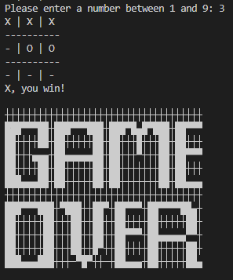
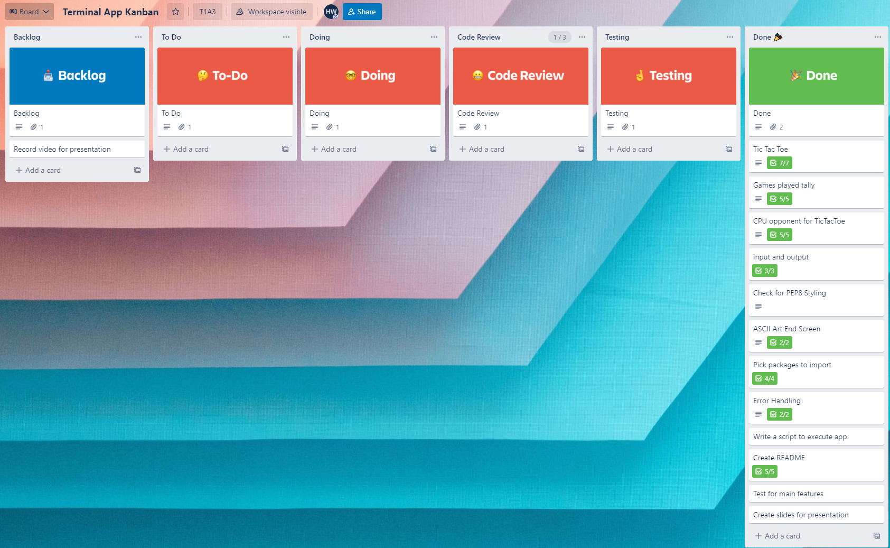

# Tic Tac Toe :o: :x: :feet:

## GitHub Repo: https://github.com/2-Can/HarryRogersWoollett_T1A3
---
## Style Guide
This code was developed following the PEP8 style guide which can be found [here](https://peps.python.org/pep-0008/).

---
## Features 

### Tic Tac Toe Game
The app features a fully playable version of the classic tic tac toe game. It displays a 3x3 grid, and prompts the user to input where on the grid they would like to place their mark. The next user is then prompted for their input and the cycle repeats. Once the board is full or a player successfully places three marks in a line, the game is over.
### Computer Opponent
By using the random module, a computer opponent has been created to play against. After each input, the computer will make its own move by marking one of the remaining open spaces on the grid.

### Games Tally
After each game completes, the result is exported to a text file.
This file can then be read and announces the total number of games played at the end of each match.

### 

---
## Implementation Plan
After pitching the idea and receiving approval, I created a Trello board using a Kanban template. 
From here, I listed out the main tasks that needed to completed in prioritised order and added a checklist to further breakdown each task. The below screenshot shows the main screen of my Trello board. Cards were moved to the appropriate columns during each stage of their implementation to track progress.

---
## Installation Guide
The best way to install the program is by first downloading the code with the following command:

`git clone https://github.com/2-Can/HarryRogersWoollett_T1A3.git `

Then, navigate to the directory and execute the bash script with the following command:

`./wrapper.sh`

This will install all required pip packages and then execute the program.

Alternatively, after cloning the repository you can manually install the below dependencies and then execute the main.py in the src directory.

---

### Dependencies: 

Simple Term Menu Package

`pip install simple-term-menu`

Clearing Package

`pip install clearing`

---
### Hardware Requirements
If you can install Linux on a toaster, this will run.

---
## Testing

Due to the structure of the program, a majority of testing was able to be completed through gameplay observation. Tests were run in a virtual environment, and the bash wrapper allowed faster setup and execution.
A pytest was set up to track the tally function, using the below code.

`def test_count():
    assert count == sum(1 for line in open('tally.txt'))`

This passed successfully after repeated gameplay loops, letting me know the connection with the text file was successful. 

---

ASCII art was used from [TextArt4U](https://textart4u.blogspot.com/2013/05/game-over-text-art.html)